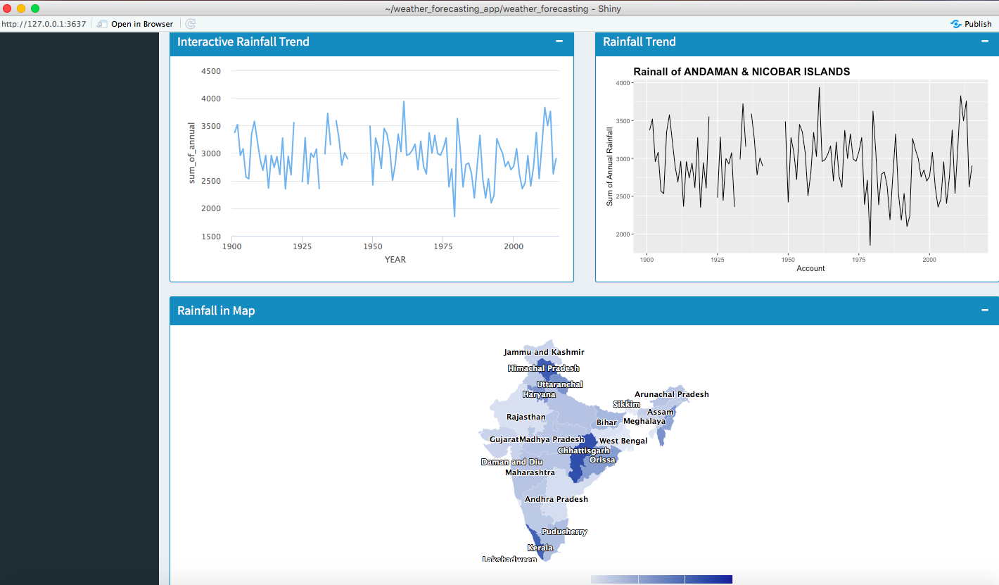

# Weather Forecasting App

### How to use?

Running with the source code: Download the repo and run open `ui.R` and run it 

Running via Github: `runGitHub('amrrs/weather_forecasting_app')`

### Packages required:

`library(shiny)`
`library(plotly)`
`library(highcharter)`
`library(shinydashboard)`
`library(ggplot2)`
`library(dplyr)`
`library(reshape2)`
`library(TSstudio)`
`library(forecast)`

If `shiny` package is missing, Use `install.packages('shiny')` to install `shiny` package. Similarly for other missing packages.

Sample Screenshot:

